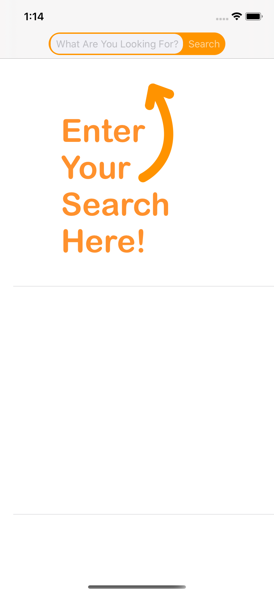
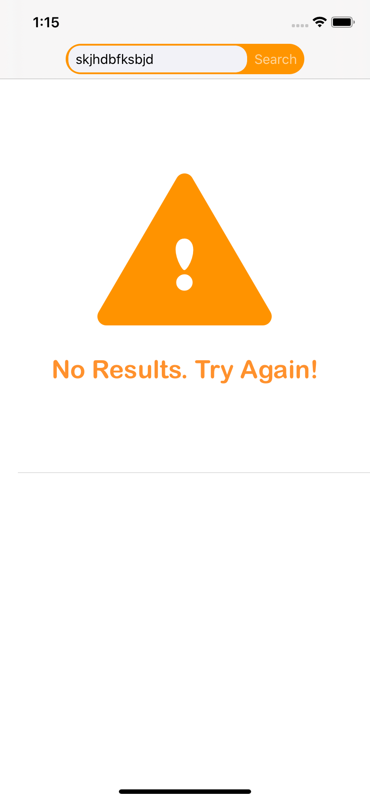
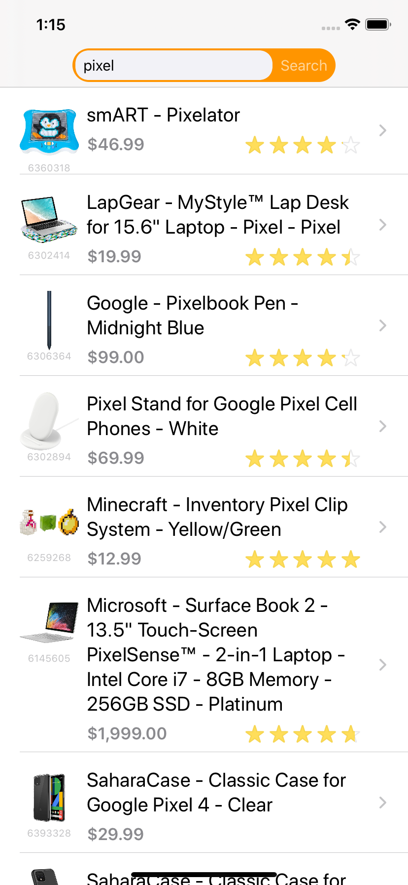
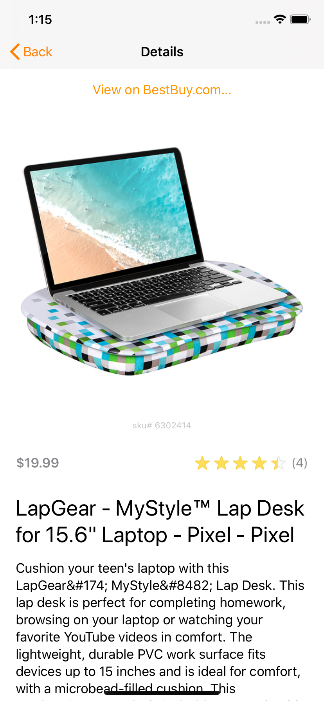

#  BBAte is an app that consumes the BestBuy API.

By Patrick Hughes

### Info:
Originally written as a sample app for [Skip](https://github.com/GoSkip/iOS-Coding-Challenge), a prospective employer. The feedback I received was that "it did not pass our code review." They did not elaborate, but I was generally happy with it, and felt that it was better than should be expected for a 4 hour project, as they suggested. (It actually took me about twice that.)  ¯\\\_(ツ)\\_/¯

This app has no dependencies.

To run the app choose a device and select Run from the Product menu.

This is app is partially tested. To run the tests select Test from the Product menu.

### Overview:
All screens support DynamicType and Dark Mode.

The initial search screen. This is just the results screen with a "search here" cell.

When the API doesn't return a result. Again, this is the results screen with a "no results" cell.

A tableview with the results of the users search. Provides an infinitely scrolling list with prefetching and automatic loading. On a decently fast connection you'll never see a loading cell (but there is one.)

Simple product details. Fun UIKit trick: This screen and the results cell both use the same ratings view, with no manual work to do so. Instead the [RatingView](BBAte/Views/RatingView.swift) implements `awakeAfter(using coder: NSCoder)` and if the view is empty loads it from a .xib file. Anytime you want a standard RatingView in a storyboard or xib you simply set a view inside a container and change its class to RatingView. As long as this RatingView is empty the version from the xib will appear instead.

